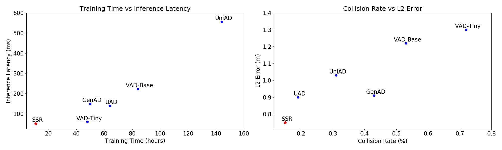
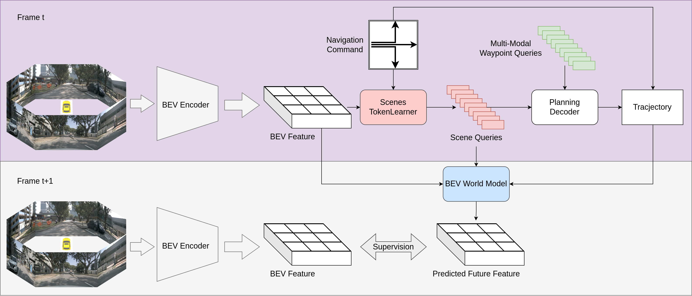
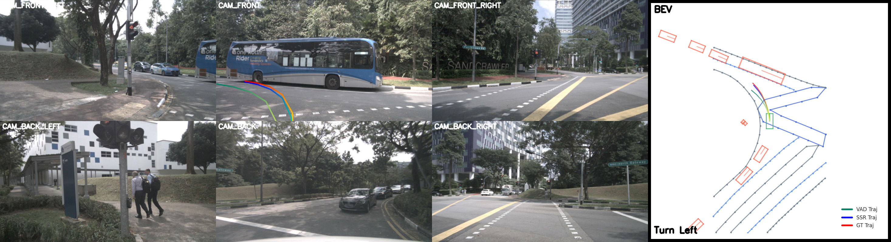

# Does End-to-End Autonomous Driving Really Need Perception Tasks? 

## [](https://arxiv.org/abs/2409.18341)

## News

- **2024.09.30** Paper of SSR available in [arxiv](https://arxiv.org/abs/2409.18341).

## Introduction
We introduce SSR, a novel framework that leverages navigation-guided Sparse Scene
Representation, achieving state-of-the-art performance with minimal costs. Inspired by how human drivers selectively focus on scene elements based on navigation cues, we find that only a minimal set of tokens from dense BEV features is necessary for effective scene representation in autonomous driving. 
<div align="center">
  
</div><br/>

## Overview
SSR consists of two parts: the purple part, which is used during both training and inference, and the gray part, which is only used during training. In the purple part, the dense BEV feature is first compressed by the Scenes TokenLearner into sparse queries, which are then used for planning via cross-attention. In the gray part, the predicted BEV feature is obtained from the BEV world model. The future BEV feature is then used to supervise the predicted BEV feature, enhancing both the scene representation and the planning decoder.
<div align="center">
  
</div><br/>

## Visualization
We visualize the results of our framework on the nuScenes dataset.
<div align="center">
  
</div><br/>

## Bibtex
If this work is helpful for your research, please consider citing the following BibTeX entry.

```
@misc{li2024doesendtoendautonomousdriving,
      title={Does End-to-End Autonomous Driving Really Need Perception Tasks?}, 
      author={Peidong Li and Dixiao Cui},
      year={2024},
      eprint={2409.18341},
      archivePrefix={arXiv},
      primaryClass={cs.CV},
      url={https://arxiv.org/abs/2409.18341}, 
}
```
